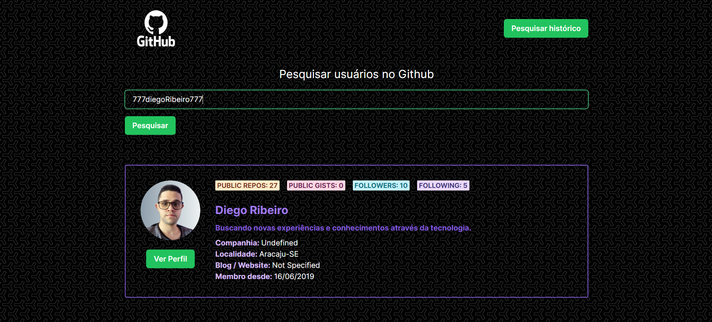
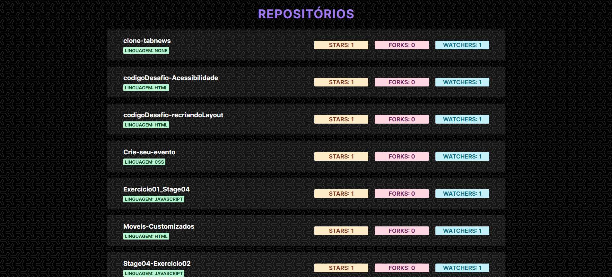

<h1 align="center"> API Github </h1>

Projeto desenvolvido no treinamento programador fullstack (Realizado pelo SENAI), do programa Meu Primeiro Emprego.  
<a href="https://primeiroemprego.se.gov.br/" target="_blank">Mais informações sobre o programa Meu Primeiro Emprego.</a>

 
  

Tela Inicial.

 
  

Seção com os Repositórios.

  <a href="" style="font-weight: bold;" target="_blank">💎 Link para o projeto.</a>

## 🚀 Tecnologias

Esse projeto foi desenvolvido com as seguintes tecnologias:

- Javascript
- React
- Chakra UI
- Next Js

## 💻 Projeto

O projeto tem como principal objetivo desenvolver um programa capaz de consumir a API do GitHub para apresentar informações detalhadas sobre um usuário específico. Para alcançar esse propósito, optou-se pelo uso das tecnologias Javascript, React, Next.js e Chakra UI. A escolha dessas ferramentas visa agilizar e dinamizar o processo de criação do projeto.

Destacando-se, em particular, o papel fundamental do Chakra UI, que desempenhou um papel crucial ao padronizar e aprimorar o design do projeto de forma coerente. A integração desta biblioteca facilitou a execução das tarefas, proporcionando uma experiência de desenvolvimento mais eficiente.

Este projeto proporcionou uma oportunidade valiosa para aprofundar os conhecimentos em consumo de dados por meio de uma API e a apresentação dessas informações. Ao final, a combinação estratégica dessas tecnologias contribuiu para uma implementação eficaz e uma experiência de usuário mais refinada.

## 🔖 Layout

O Layout do projeto foi baseado em um tutorial do Youtube. Sendo que, modificações foram feitas pelo desenvolvedor afim de torna-lo mais pessoal, do seu gosto e condizente com a as demandas passadas em sala pelo professor.
<ul>
<li>link de referência:</li>
<a href="https://youtube.com/watch?v=N5CtgyQHjAE&list=PLjGomq7bcPFEgKqYGj6utbttp5u6PMEj1&index=28&t=949s">Every beginner should build this project | React, Chakra UI, Github API | Full Course</a>
</ul>